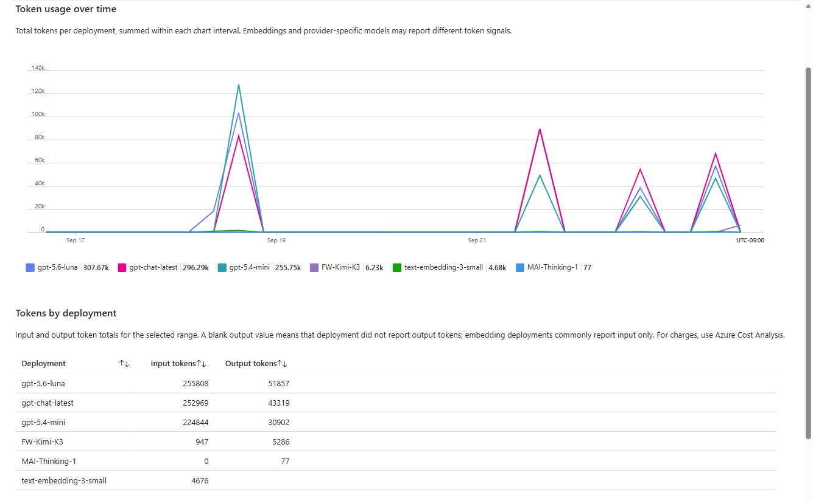
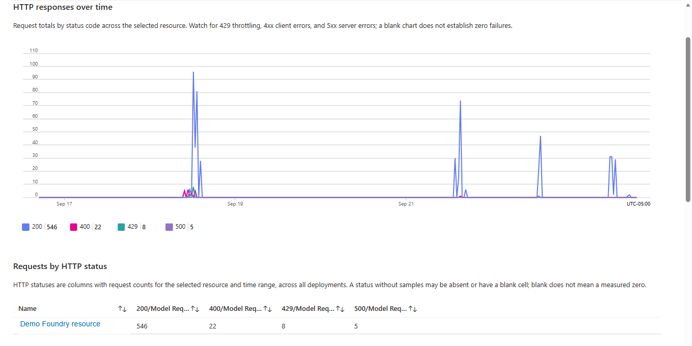
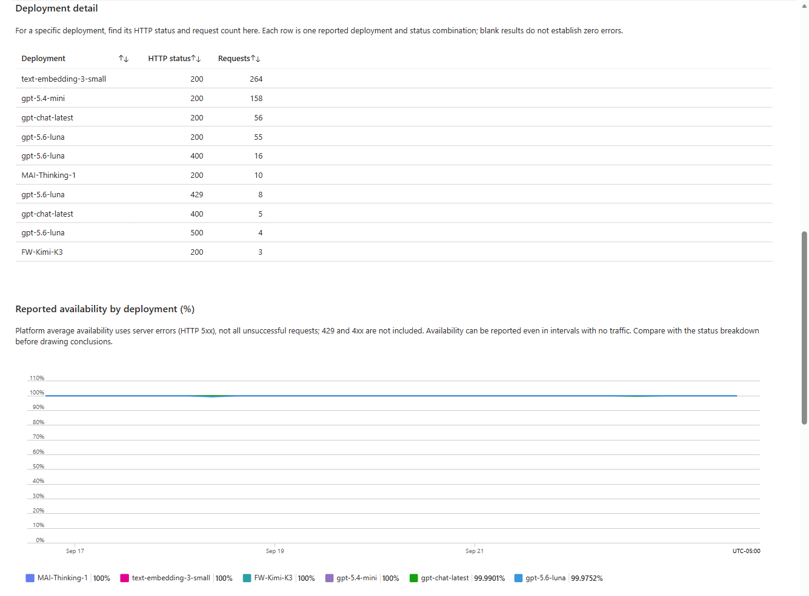

# Foundry Model Observability Kit

Four deployable **model-only Azure Monitor workbooks** for Microsoft Foundry and Azure OpenAI accounts. This kit uses platform metrics directly: no Application Insights, Log Analytics workspace, tracing, or diagnostic export is required or provisioned.

| Workbook | Focus |
| --- | --- |
| **Model Fleet & Usage** | Combined subscription/underlying-model input/output/total-token and request totals, with separate account/deployment trends and detail |
| **Model Inference Health** | HTTP response trends, account-wide and per-deployment status counts, reported availability, and response time |
| **Model Volume, Latency & Availability** | A focused operational view with three deployment-level trends and summary tables: request totals, average/maximum gateway latency, and average/minimum reported availability |
| **Model Usage vs Capacity** | One-minute processed tokens vs current allocated TPM (approximate), requests vs RPM equivalent, PTU utilization vs 100%, and HTTP 429 counts |

The operational workbook defaults to **24 hours**; capacity drilldown defaults to **one hour** and offers up to six days at one-minute resolution (8,640 points per series, below the portal chart's 10,000-point limit). Use shorter ranges for interactive performance. All workbooks include subscription, multi-account comparison, detail-account, and time-range pickers, plus account and project inventory. Native trends retain separate account/deployment series; Fleet additionally combines scalar totals by subscription/model. Metrics request up to 1,000 model/deployment series per resource.

**Admin scope:** select subscriptions, then select multiple **Compare accounts** entries to compare their metrics. **Detail account** picks one of those accounts for ARM summary tables; Usage vs Capacity also has a deployment picker. Account inventory includes full resource IDs so identical account/deployment names are not mistaken for the same resource. Project inventory lists `Microsoft.CognitiveServices/accounts/projects` and its parent account. Account/deployment metrics are **not attributed to individual projects** that share an account. Discovery is limited by RBAC and the portal's available subscriptions, not a complete tenant inventory.

## Prerequisites

- An existing `Microsoft.CognitiveServices/accounts` resource of kind `AIServices` or `OpenAI`, with model deployments and traffic in the selected range.
- Permission to deploy workbooks in the target resource group.
- **Monitoring Reader** (or equivalent metrics-read access) on the selected account, plus Reader access to the saved workbooks.
- Resource-read access on selected accounts/projects and `Microsoft.CognitiveServices/accounts/deployments/read` for capacity configuration.
- [Azure CLI](https://learn.microsoft.com/cli/azure/install-azure-cli), authenticated with `az login`. Azure Developer CLI is needed only for the optional `azd` deployment below.

See [prerequisites](docs/prerequisites.md) for permissions and metric coverage.

## Deploy

Deploy all four workbooks into an existing resource group:

```powershell
$modelId = az resource show --resource-group "<account-rg>" `
  --resource-type "Microsoft.CognitiveServices/accounts" `
  --name "<foundry-account>" --query id -o tsv

az deployment group create `
  --resource-group "<workbook-rg>" `
  --template-file "infra\main.bicep" `
  --parameters modelAccountResourceId="$modelId"
```

The account can be in a different resource group. Its subscription initializes the subscription picker; other accessible subscriptions can be selected in the workbook. `infra\model-workbooks.bicep` is also a standalone entrypoint with the same inputs and outputs.

### Optional: Azure Developer CLI

```powershell
azd auth login
azd env new foundry-model-observability-dev
azd env set AZURE_LOCATION eastus
azd env set AZURE_RESOURCE_GROUP "<existing-workbook-rg>"
azd env set MODEL_ACCOUNT_RESOURCE_ID "<full-foundry-account-resource-id>"
azd provision
```

The mapping is in [infra/main.parameters.json](infra/main.parameters.json); [.azure/.env.example](.azure/.env.example) lists the environment values. These templates deploy only workbooks and optional workbook-scoped Reader assignments. They do not create accounts, deploy models, enable logs, or generate traffic.

### Open the workbooks

In the Azure portal, go to **Monitor > Workbooks > Saved workbooks** and select the deployment subscription and resource group. The resource picker defaults to the account passed at deployment and lists accessible Foundry/Azure OpenAI accounts from the portal's selected subscriptions.

Both deployment entrypoints return:

- `modelFleetWorkbookResourceId`
- `modelHealthWorkbookResourceId`
- `modelSignalsWorkbookResourceId`
- `modelCapacityWorkbookResourceId`

Optional `sharedViewerPrincipalObjectIds` and `sharedViewerPrincipalType` inputs grant Reader on **all four workbooks**. They do not grant access to the account's metrics or deployment configuration; grant that separately. See the [deployment and validation guide](docs/deployment-and-validation.md).

## Fleet subscription/model comparisons

Fleet defaults to a **combined subscription/model totals** table. `ModelName` identifies the underlying model, regardless of deployment aliases; versions with the same model name are combined. It sums input, output, total tokens, and requests across **all selected Compare accounts** within each subscription. Select subscriptions first, then choose the accounts to include; subscription selection alone does not select every account.

The table groups by full subscription resource ID, then model name, and shows an all-model subscription subtotal. Expand model rows to inspect contributing accounts. Same-named models in different subscriptions remain separate. All-missing output remains blank, including embeddings; measured zero remains zero. Totals cover the selected range and are not utilization or billed cost.

**Trends are account/deployment-scoped, not rolled up by subscription/model.** Grouped Sum sparklines are intentionally hidden because the portal fills missing grouped buckets with zero. Separate token/request trends and the detail-account deployment table remain available without introducing that grouping fallback. If only one subscription is accessible in the signed-in directory, live comparisons cover that subscription only; cross-subscription identity/null regressions use synthetic fixtures.

## Usage versus capacity

The capacity workbook reads **current deployment rate limits** from ARM, without converting SKU capacity units. TPM/RPM equivalents are `60 * count / renewalPeriod` using each reported token/request rule. Ten requests per ten seconds means 60 RPM equivalent, but not a permitted burst of 60 requests. Missing or unusable limits display **Unavailable**; no SKU multiplier or fabricated capacity is substituted.

Processed `TotalTokens` per minute is an **approximate** comparison with allocated TPM: Azure throttles using arrival-time estimated tokens, including requested output, rather than processed totals. Request limits can be enforced over sub-minute windows; dynamic throttling and bursts can produce 429s below the line. PTU uses `ProvisionedUtilization` against 100%, with average and maximum samples. Non-PTU/no-sample deployments do not establish zero utilization.

Horizontal reference lines use capacity read **now**, not the historical limit at each timestamp. This is deployment usage versus capacity, **not subscription assigned quota** or billed cost. The workbook never aggregates hourly token totals against a per-minute limit.

## Interpreting the three signals

| Signal | Metric | Interpretation |
| --- | --- | --- |
| Request volume | `ModelRequests`, Total | All inference requests, including unsuccessful responses; trends show interval totals and tables show selected-range totals |
| Latency | `TimeToResponse` or `AzureOpenAITimeToResponse`, Average/Maximum | Gateway time to first response in milliseconds, not end-to-end completion latency or p95 |
| Availability | `ModelAvailabilityRate`, Average/Minimum | Reported percentage excluding HTTP 5xx; HTTP 4xx and 429 do not reduce this metric |

**Latency coverage matters.** Foundry Models `TimeToResponse` is documented for PTU/PTU-managed workloads. The focused workbook's **Latency metric** picker also supports `AzureOpenAITimeToResponse`, documented for Azure OpenAI PTU and pay-as-you-go deployments. Select the signal appropriate to your models; the workbook does not silently substitute metrics. The existing Inference Health workbook retains the Foundry Models metric.

**Missing samples stay missing.** Empty charts and blank cells are not zero usage, zero latency, or 100% availability. Provider and deployment support varies. Availability aggregates are not a request-weighted SLO or an external uptime check; minimum reported availability helps identify dips but does not measure outage duration. Use Inference Health for HTTP status details. Token counts are usage indicators, not billed cost.

Metrics are collected automatically. Do not rely on `AzureDiagnostics` or exported `AzureMetrics` for per-deployment dimensions; these workbooks query Azure Monitor metrics directly. See [metric sources and semantics](docs/schema-sources.md).

## Earlier model workbook screenshots

**Model Fleet & Usage**:

This earlier capture shows deployment detail; the current Fleet workbook adds subscription/model totals above it.



**Model Inference Health**:





## Repository layout

```text
azure.yaml                  # Optional azd project
infra/main.bicep             # Model-only deployment entrypoint
infra/model-workbooks.bicep  # Four workbooks and optional viewer roles
workbooks/                  # Azure Monitor workbook JSON definitions
docs/                       # Prerequisites, metric references, and validation
scripts/build_workbooks.py   # Idempotent common scope and capacity workbook generation
tests/                      # Definition, identity, normalization, and null-semantics checks
```

Derived from [Foundry Observability Kit](https://github.com/MaxBush6299/foundry-observability-kit). This standalone edition retains the model workbooks and removes the tracing-based dashboards and monitoring infrastructure.
